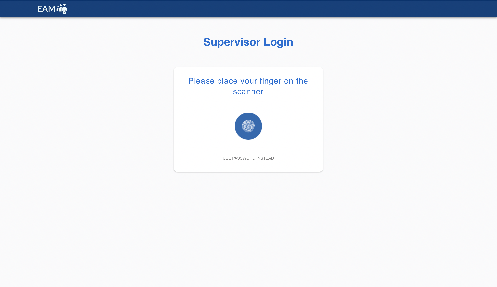
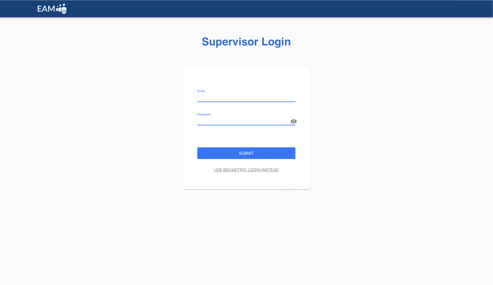

# Exam-Attendance-UI

This is the front end app for the exam attendance.

# Project Screen Shot(s)

### Examiner login page

Examiner can login using fingerprint.

### Examiner login page

Examiner can use email and password to login.

### Exam schedule page

After the examiner logs in, he/she can view the exams assigned to him/her for the current day.

### Exam attendance monitoring page

When the examiner selects an exam from the Exam Schedule Page, he/she will be directed to the attendance monitoring page. Examiner can view all the students enrolled for that module along with the thier attendance details.

### Student atendance marking page

Once examiner press `Start Attending` on `Attendance Monitoring` page. This window will be opened to take attendance of students.

### Student atendance marking page

If a student prefers to use an index instead of a fingerprint, this page allows that option.

# Installation and Setup Instructions

Installation:

`npm install`

To Start Server:

`npm start`

# Reflection

This is a group project completed for the implementation of MOSIP platform developed for the Professional Practise Module.
